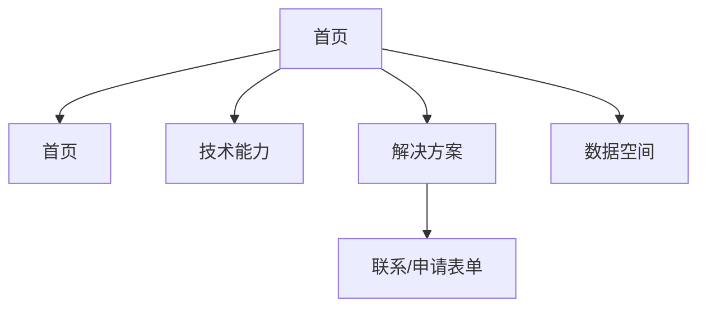
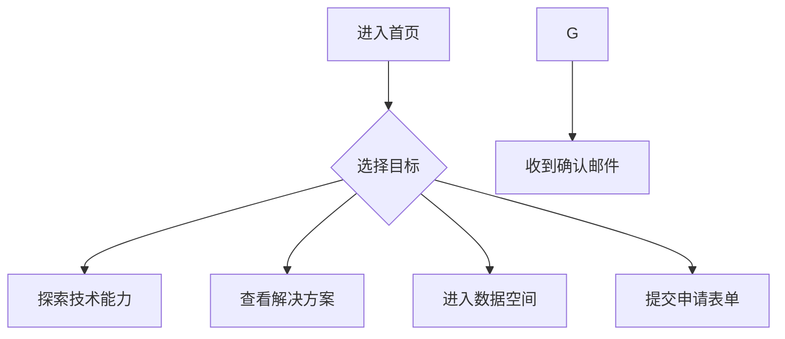

# 文旅可信数据空间门户网站 - 产品细节文档

## 目录
1. [产品概述](#1-产品概述)
2. [核心功能需求](#2-核心功能需求)
3. [功能架构与流程](#3-功能架构与流程)
4. [非功能需求](#4-非功能需求)
5. [未来功能储备](#5-未来功能储备)

---

## 1. 产品概述
- **产品名称**：文旅可信数据空间门户网站（V1.1）
- **定位**：作为“文旅可信数据空间”的品牌宣传窗口和生态激活平台，展示联盟成效、数据产品和服务，促进数据要素流通与价值释放。
- **目标用户**：
  - **文旅企业**：连锁酒店、旅行社、景区等，需解决数据孤岛、合规顾虑问题。
  - **政府机构**：文旅局、大数据局等，关注行业监管与跨域协同。
  - **数商/技术服务商**：数据提供方或技术公司，需可信交易市场。
- **目标平台**：Web（PC+移动端响应式），只需要中文。

**关键KPI**：
| 指标 | 目标 | 说明 |
|------|------|------|
| 月页面浏览量 | 10,000+ | 衡量品牌曝光效果 |
| 平均停留时间 | ≥2分钟 | 核心页面（如解决方案、联盟生态） |
| 关键页面跳出率 | ≤30% | 首页、数据目录、申请表单 |
| 有效线索数量 | ≥50/月 | 通过申请/联系表单收集的SQL |

---

## 2. 核心功能需求

### 2.1 用户故事
| 用户类型 | 用户故事 | 验收标准 |
|----------|----------|----------|
| 文旅企业 | 作为市场总监，我希望浏览解决方案页面，了解平台如何解决客流分析问题，以便评估是否申请试用。 | 解决方案页面清晰展示3类用户痛点与价值；点击“申请试用”跳转至表单，提交后5s内显示确认提示。 |
| 政府机构 | 作为文旅局官员，我希望查看联盟动态和成效报告，以了解平台进展和跨域试点计划。 | 成效中心包含动态数字（联盟成员数、产品数）；联盟动态支持按时间筛选，加载时间<2s。 |
| 数商 | 作为数据提供商，我希望通过发布会专题页了解联盟活动并提交合作意向。 | 发布会专题页包含议程、回放链接；合作意向表单提交后触发邮件通知。 |

### 2.2 功能逻辑

#### 2.2.1 首页

[第1屏] 核心价值主张

[第1屏文案内容]

主标题：文旅可信数据空间门户。
 * 副标题：全国首个丨文化数据要素全生命周期服务平台。
 * 核心价值：“人工智能+”文化 数据资源基座
 * 口号：让人类文明结晶，焕发数字世界全新价值。
 * 详细描述：平台致力于突破数据确权、交付、溯源及保护的技术瓶颈，为文旅产业的数字化转型注入可信动能。
* [第1屏设计内容]
标题文案内容集中在左方，右方展示词云图轮播，用各式各样的文件名后缀来展示平台在数据上的包罗万象，不同的词云图侧重展示数据处理的不同维度，如“存储”、“加工”、“交易”、“存证”。使用在 word-cloud/ 文件夹中的所有图片。
* [第1屏交互元素]
一个在左边的显眼“马上进入”按钮，引导用户进行下一步操作。

[第2屏]  全生命周期服务闭环

[第2屏文案内容]

标题：守护文旅数据要素全生命周期
 * 副标题：提供闭环全链路解决方案
 * 具体包括四个方面：

 1. 数据要素化服务：提供智能化工具将多源数据加工成标准产品
结合区块链与数字水印、数字指纹等技术，生成唯一数字身份，从源头完成文化数字资产确权与保护
 2. 全周期维权服务：引入AI全网监控，实时发现侵权行为并固化证据
联动专业机构提供从取证到维权的一站式服务，形成保护闭环
 3. 可信交易生态：通过身份核验与智能合约构建信任基础
运用算法撮合供需，结合信用评分与黑名单机制，营造安全、高效的交易生态
 4. 安全交付方案：针对不同数据资产、数据规模，提供定制化安全交付方案
TB级数据采用专用连接器通路传输，PB级数据通过加密物理介质离线交付
* [第2屏设计内容]
此屏分为三列内容，左右一列分别列出2个服务标题及内容，图示放在中间，这是一个由4个1/4圆弧组成的圆环，圆弧的形态像是箭头，整体看上去是一个顺时针转动的圆环，表示周期的完整。圆环外部，左右两方是标题和解释性文字，结构清晰，易于理解。
圆环使用 img-folder/ 文件夹中的 “生命周期_compressed.png” 图片。
* [第2屏交互元素]
无明显交互元素，为静态信息展示区。

* [第3屏]  技术速览

[第3屏内容]
标题：可信基石 · 构筑数据价值的核心技术引擎
设计理念：采用中心辐射结构。画面正中央是一个发光的主题色（蓝色）核心，四个技术分支从核心分别延伸至左上、右上、左下和右下角。

*   **中心:** 一个发光的、圆润的蓝色盾牌形状，内部有两行白色或淡蓝色的文字：“可信数据核心”。
*   **左上角分支:** 标题文字为“数据确权与资产化”，下方有两行小字：“区块链存证”、“DCI版权”，并配有一个简约的文档或证书图标。
*   **右上角分支:** 标题文字为“隐私计算与安全沙箱”，下方有两行小字：“多方安全计算”、“联邦学习”，并配有一个简约的带加号的盾牌图标。
*   **左下角分支:** 标题文字为“AI驱动的价值挖掘”，下方有两行小字：“侵权监测”、“智能匹配”，并配有一个简约的“AI”字母图标。
*   **右下角分支:** 标题文字为“全链路可信交付”，下方有两行小字：“加密传输”、“权限管控”，并配有一个简约的带锁和循环箭头的图标。

** 视觉风格与氛围:**
*   **背景:** 浅灰色或白色，带有淡淡的、科技感的同心圆光环纹理。
*   **主色调:** 以蓝色和深灰色为主。所有的核心图形和连接线都带有优雅的蓝色霓虹光效。
*   **线条:** 连接中心与分支的线条流畅、纤细。
*   **整体氛围:** 营造出干净、专业、未来感和技术安全感。

**底部元素:**
在图表下方正中，设计一个蓝色色的圆角按钮，按钮上的白色文字是“探索全部技术能力”。链接到 【技术能力】子页面。

* [第4屏]  商业价值

[第4屏内容]

标题：双轮驱动，释放数据全场景价值
设计： 采用左右两大卡片并排的布局，视觉上 gleichwertig，但内容上各有侧重。每个卡片都包含标题、简介和行动按钮。
左侧卡片：商业增长引擎
图标： 代表增长、商业或精准定位的图标。
标题：企业与社会数据解决方案
简介： 聚焦文旅产业的真实痛点，我们将高质量的企业与社会数据，通过成熟的解决方案，转化为驱动您商业增长的精准洞察与核心动力。
行动按钮： 探索商业解决方案 (链接至“解决方案”页面)
右侧卡片：社会价值引擎
图标： 代表政府、公共或生态的徽章类图标。
标题：公共数据授权运营（旗舰计划）
简介： 作为行业先行者，我们搭建了连接政府数据与市场创新的桥梁。我们诚邀您参与这一旗舰计划，共同探索公共数据的社会价值蓝海，赋能行业治理与中小企业创新。
行动按钮： 了解旗舰计划详情 (链接至“公共数据运营授权”页面文章)

[第5屏]

[第5屏文案内容]
主标题：联盟生态

左侧：
千岛湖共识
——文旅可信数据空间联盟倡议
主体优先，可控授权；  
协同优先，多方共建；  
共创优先，收益同享；  
安全优先，技术护航；  
持续优先，生态驱动；  
合规优先，动态治理；  
开放优先，全球互认。 

右侧：
联盟单位：呈两列排布，图左方放纯文字的理事长单位副理事长单位、秘书长单位、副秘书长单位。
理事长单位
浙江省文化产业投资集团
副理事长单位
中国数字化集团
携程集团有限公司
浙江省旅游投资集团有限公司
浙江飞猪网络技术有限公司
中国联合网络通信有限公司杭州分公司
秘书长单位
浙江省文化广电和旅游大数据中心
副秘书长单位
淳安县数据资源中心
右边放其他所有理事单位和成员单位的logo。

下方版面：

最新动态：展示联盟的最新新闻和行业发布，如“文旅可信数据空间联盟大会顺利召开”。
 2. 组织架构：列出了项目的牵头主体、运营主体、生态联盟和技术支持单位。
* [第5屏设计内容]
主标题居中，下面是左右两侧的分布。左边是千岛湖共识，右边是联盟单位图示。
最新动态作为子版块处于下方，左侧为新闻列表的图示，右侧为新闻列表的标题。
* [第5屏交互元素]
“最新动态”中的新闻标题是指向新闻详情页的链接。

#### 2.2.2 技术能力

[第1屏]

[第1屏文案内容]

标题：统一入口六大引擎多元汇聚。
 * 核心能力概述：提供1个门户、6大能力及多种接入方式。
 * 六大核心引擎：

 * 确权登记：为非结构化、多模态数据资产，提供唯一、可信的数字身份和数据产权登记
 * 安全管控：从数据合规、身份认证到行为评估，构建立体化可信环境，全方位保障安全
 * 互联互通：突破平台与技术壁垒，打通跨主体、跨空间、跨资产链的数据资源
 * 价值共创：以智能算法为驱动，精准匹配供需，最大化挖掘和释放数据价值
 * 可信交付：在线与离线双通路交付方案协同，确保数据在约定范围内授权使用
 * 交易支撑：提供从支付清算到合约治理的全链路交易保障，让交易公平透明
* [第1屏设计内容]
以一个中心图形发散出六个分支，每个分支代表一个核心引擎，并配有相应图标，视觉上强调了各引擎的协同作用。
* [第1屏交互元素]
无交互元素，为静态信息展示区。

[第2屏] - 技术工具箱

[第2屏文案内容]

标题： 技术工具箱
工具一 (重点)：数据确权登记与存证
描述： 基于国家“数文链”与多链融合技术，结合DCI数字作品版权登记，为您的数据资产提供唯一、可信的数字身份。从源头解决数据权属问题，为流通交易提供法律依据。
技术关键词： 区块链存证、可信时间戳、哈希值校验、DCI登记
交互元素： 一个醒目的按钮 “开启登记合作”，点击后弹出合作意向表单或显示联系方式。
工具二：隐私计算与安全沙箱
描述： 提供“数据可用不可见”的安全计算环境。您可以在不暴露原始数据的情况下，进行联合分析、联合建模，安全地挖掘数据价值。
技术关键词： 多方安全计算(MPC)、联邦学习(FL)、可信执行环境(TEE)
工具三：AI侵权监测与维权
描述： 利用先进的AI图像与文本比对技术，实现7x24小时全网监测，快速发现侵权盗用行为，并提供从取证到司法诉讼的一站式维权支持。
技术关键词： 感知哈希算法、自然语言处理、自动化取证
工具四：多模态数据标注与训练
描述： 提供针对图像、视频、文本等多种类型数据的高效标注工具与服务，为训练文旅行业大模型提供高质量、合规的“数据燃料”。
技术关键词： 自动化标注、数据清洗、数据集管理

[第2屏设计内容]
设计： 采用模块化卡片布局，每个卡片代表一个核心技术工具，包含图标、名称、简短描述。重点突出“数据确权登记与存证”模块。

[第3屏] - 稳固的技术架构

[第3屏文案内容]

标题：技术架构。
 * 架构分层：
- 应用门户：为用户提供可视化交互平台，提升业务透明度，为供需双方的数据要素流动赋能。最终达成良好的生态治理循环，实现数据全生命周期的管理与保护
- 服务枢纽：降低应用开发门槛，为其提供统一入口与自动化工具，强化确权监测与传输能力建设，支撑应用核心功能的具体实现。推动数据价值的快速变现，促进空间的生态创新与可持续发展
- 核心引擎：构建合规与信任机制，通过智能撮合和治理模型，桥接底层资源与上层应用，提供可复用的服务，完成数据生产、确权和交易的流程闭环
- 底层基石：以保障高效存储、安全计算、可信传输，在算力、带宽上实现资源复用与弹性扩展，支持海量多模态数据可靠管理，推动数据资产的长期价值释放
* [第3屏设计内容]
左边是一个自上而下的四层结构图，清晰地展示了平台的技术层级关系，使用 img-folder/ 文件夹中的 “架构图final_compressed.png” 图片；每层都有简要的功能说明。
* [第3屏交互元素]
无交互元素，为静态架构图。

#### 2.2.3 解决方案

**页面结构概述：**  
解决方案页面采用标签页导航设计，分为“企业与社会数据解决方案”和“公共数据授权运营解决方案 (旗舰计划)”两大板块，通过标签切换展示不同领域的解决方案。

**[第1屏] 页面头部**  
- **设计**：全宽背景，浅灰色渐变背景，居中布局  
- **标题**：解决方案中心  
- **副标题**：我们将原始数据转化为商业洞察与社会价值，为您的每一步决策提供可信依据。  
- **交互**：无特殊交互，静态展示区域  

**[第2屏] 标签页导航**  
- **设计**：水平标签页导航，当前激活标签有底部边框高亮  
- **标签选项**：  
  - 企业与社会数据解决方案（默认激活）  
  - 公共数据授权运营解决方案 (旗舰计划)  
- **交互**：点击标签切换对应内容区域，平滑过渡效果  

**[第3屏] 企业与社会数据解决方案**  
- **布局**：两列网格布局，每列一个解决方案卡片  
- **解决方案一：智慧景区 · 精准营销与运营优化**  
  - **图标**：用户群图标 (fas fa-users)  
  - **标题**：智慧景区 · 精准营销与运营优化  
  - **描述**：融合运营商信令、OTA平台等多源数据，构建动态客源地画像与游客行为模型。通过平台提供的API接口和可视化报告，赋能景区进行精准广告投放和智慧化现场管理。  
  - **核心功能**：  
    - 游客来源地分析报告  
    - 景区实时客流热力图  
    - 游客消费偏好标签集  
  - **行动按钮**：探索商业应用  

- **解决方案二：数字文博 · AIGC内容创制与IP活化**  
  - **图标**：文物图标 (fas fa-landmark)  
  - **标题**：数字文博 · AIGC内容创制与IP活化  
  - **描述**：提供经过精细标注和合规审查的多模态数据集，包含海量历史影像、三维文物模型、典籍文献等。这些高质量数据可直接用于训练或优化文旅垂直领域的AIGC大模型。  
  - **核心功能**：  
    - 中国古建筑风格图像数据集  
    - 青铜器纹样矢量化数据集  
    - 历代书法碑拓文本数据集  
  - **行动按钮**：探索商业应用  

**[第4屏] 公共数据授权运营解决方案 (旗舰计划)**  
- **布局**：层级化流程图布局，分为四层，从上至下展示完整流程  
- **标题**：旗舰计划 · 共创公共数据价值新生态  
- **引导语**：作为文旅领域公共数据授权运营的先行者，我们搭建了一座连接政府数据资源与市场创新活力的桥梁。我们诚邀您加入这个开创性的生态，共同探索数据要素的“第四形态”。  

- **第一层：坚实基础 · 合规的公共数据源**  
  - **图标**：代表政府的徽章图标 (fas fa-landmark)  
  - **描述**：平台已与省市数据管理部门达成战略合作，在确保绝对安全与隐私保护的前提下，授权接入以下核心公共数据资源：  
    - A级景区名录与客流统计  
    - 文保单位与非遗名录  
    - 公共文化场馆（图书馆、博物馆）开放信息  
    - 重大节假日交通枢纽与住宿设施数据  
  - **行动按钮**：了解详情  

- **第二层：价值引擎 · 平台的核心处理能力**  
  - **图标**：齿轮图标 (fas fa-cogs)  
  - **描述**：原始数据通过平台独有的“数据中央厨房”进行加工，实现价值倍增：  
    - 数据治理与标准化：清洗、去重、统一格式，形成高质量数据底板。  
    - 脱敏与隐私保护：采用业界领先技术，确保数据可用不可见。  
    - 建模与指数化：将离散数据加工成具有洞察力的指数产品，如“活力指数”、“消费潜力指数”。  
    - 产品化封装：通过标准API、数据报告、可视化大屏等形式，将数据封装成易于调用的产品。  
  - **行动按钮**：了解详情  

- **第三层：成果展现 · 可用的数据产品目录**  
  - **图标**：立方体图标 (fas fa-cube)  
  - **描述**：我们将公共数据转化为以下即用型数据产品，赋能多领域创新：  
    - 区域文旅活力指数：为政府规划、商业选址提供宏观决策依据。  
    - 公共文化服务热力图：优化公共文化设施布局，提升服务效率。  
    - 节假日出行预测模型：辅助交通与旅游管理部门进行应急预案部署。  
    - 中小企业文旅商机洞察：为初创企业提供低成本的市场分析工具。  
  - **行动按钮**：了解详情  

- **第四层：生态共创 · 赋能多元应用场景**  
  - **图标**：网络图标 (fas fa-network-wired)  
  - **描述**：我们诚邀以下领域的伙伴，共同基于公共数据产品进行创新应用开发：  
    - 城市规划与治理：优化旅游线路，提升公共服务水平。  
    - 金融保险服务：开发针对小微文旅企业的信用评估与保险产品。  
    - 学术研究与咨询：为高校和研究机构提供行业发展分析的一手数据。  
    - 创新应用开发：鼓励开发者和初创企业打造便民惠民的智慧文旅应用。  
  - **行动按钮**：了解详情  

**[第5屏] 成功案例展示**  
- **设计**：浅灰色背景区域，两列案例卡片布局  
- **案例一：智慧景区项目**  
  - **行业**：旅游景区  
  - **挑战**：如何在激烈的市场竞争中精准触达高价值潜客？如何实时掌握客流动态，优化资源配置与游客体验？  
  - **实施效果**：  
    - 营销ROI提升30%+  
    - 运营人力成本降低15%  
    - 游客满意度显著提高  

- **案例二：数字文博项目**  
  - **行业**：文化机构  
  - **挑战**：如何让沉睡的馆藏文物“活”起来？如何利用AIGC技术，低成本、高效率地生产引人入胜的数字化内容与文创产品？  
  - **实施效果**：  
    - 文创产品开发周期缩短50%  
    - 数字展览内容生产成本降低80%  
    - 打造现象级数字文化IP  

**[第6屏] 行动号召区域**  
- **设计**：居中布局，双按钮设计  
- **标题**：加入我们，成为公共数据价值的共创者  
- **描述**：我们提供：  
  - 优先的数据权限：成为首批访问和测试公共数据产品的合作伙伴。  
  - 专业的技术支持：平台技术专家团队将为您提供全程的接入与应用指导。  
  - 标杆的品牌曝光：您的成功应用案例将被作为旗舰计划的标杆进行展示和推广。  
- **按钮选项**：  
  - 立即申请成为试点伙伴（链接至合作申请表单）  
  - 了解更多（链接至联系页面）  

- **申请/联系表单**：
  - 表单：姓名、职位、电话、邮箱、公司、行业、需求标题、场景描述。
  - 逻辑：分步式表单，提交后触发CRM通知，数据标签化存储。
  - 异常处理：必填项未填写时，提示具体字段；文件超10MB时，提示重新上传。

### 2.3 验收标准
- 页面加载时间<2s，核心功能响应时间<1s。
- 表单提交成功率>95%，失败时提供清晰错误提示。
- 所有页面支持中英双语切换，翻译准确率>98%。
- 动画/图表在主流浏览器（Chrome、Safari、Edge）无兼容性问题。

---

## 3. 功能架构与流程

### 3.1 信息架构

### 3.2 用户旅程

---

## 4. 非功能需求
- **性能**：页面加载时间<2s，CDN加速，图片压缩<500KB。
- **安全**：遵守《数据安全法》《个人信息保护法》，隐私政策/用户协议入口明确。
- **可访问性**：遵循WCAG 2.1 A级标准，支持屏幕阅读器、键盘导航。
- **多语言**：支持中英双语，动态切换，翻译内容需人工校对。
- **兼容性**：支持主流浏览器（Chrome、Safari、Edge、Firefox）及移动端（iOS 14+、Android 10+）。

---

## 5. 未来功能储备
- **V1.2 (Q1 2026)**：
  - 用户中心：注册、登录、企业认证。
  - 在线申请流程：试用申请、审批状态跟踪。
  - 跨域试点入口：淳安试点专题页面。
- **V1.3 (Q2 2026)**：
  - 场景需求发布：用户发布数据需求，平台撮合。
  - 动态数据看板：展示实时交易数据。
- **V2.0 (2026年底)**：
  - “中央厨房”集成：支持个性化数据分析、推荐服务。
  - AI文旅大模型入口：展示训练数据集产品。

