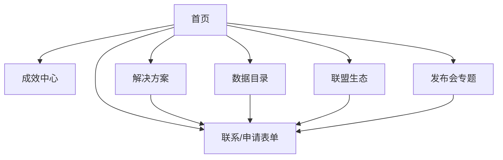

# 文旅可信数据空间门户网站 - UI 设计文档

## 目录
1. [设计目标与风格定位](#1-设计目标与风格定位)
2. [信息架构与交互流程](#2-信息架构与交互流程)
3. [关键界面说明](#3-关键界面说明)
4. [交互规范](#4-交互规范)
5. [视觉规范](#5-视觉规范)
6. [可用性与可访问性标准](#6-可用性与可访问性标准)

---

## 1. 设计目标与风格定位
- **目标**：打造简约专业、数据可视化驱动的品牌门户，传递“信任之环，文旅之光”的核心理念。
- **风格**：
  - **科技感**：通过网格布局、渐变色（蓝/青）、动态图表传递可信与高效。
  - **文旅感**：融入山水意境、非遗元素（如青瓷冰裂纹）作为背景/装饰。
  - **情感**：冷静可信，避免营销化，确保用户信任数据安全。

---

## 2. 信息架构与交互流程

**用户路径**：
1. 用户进入首页，快速了解平台价值。
2. 导航至解决方案/成效中心/联盟生态，深入探索。
3. 点击“申请试用”或“联系我们”，进入分步式表单，完成提交。

---

## 3. 关键界面说明

### 3.1 首页
- **布局**：
  - 顶部：导航栏（成效中心、解决方案、数据目录、联盟生态、发布会专题、语言切换）。
  - 中部：全屏Banner（文旅+科技视觉，含CTA按钮“了解更多”）。
  - 下部：动态数字翻牌器（联盟成员数、产品数）、时间线（发展历程）、交互地图（成员分布）。
- **交互**：点击CTA跳转至解决方案，地图支持悬停显示成员详情。

### 3.2 解决方案
- **布局**：
  - 3个模块：文旅企业、政府机构、数商，各自展示痛点与价值。
  - “可用不可见”动画：模拟数据流通（数据库→安全沙箱→结果输出）。
- **交互**：点击模块内CTA跳转至表单。

### 3.3 数据目录
- **布局**：
  - 筛选栏：行业（景区、酒店等）、数据类型（客流、消费偏好等）。
  - 列表：卡片式展示（产品名称、简介、场景）。
- **交互**：筛选后动态更新列表，无结果时弹出“提交需求”提示。

### 3.4 联盟生态
- **布局**：
  - Logo墙：37家成员Logo，网格布局。
  - 动态区：新闻列表，支持按时间排序。
- **交互**：Logo悬停显示企业简介，点击跳转至官网。

### 3.5 发布会专题
- **布局**：
  - 顶部：活动标题、倒计时（若未结束）。
  - 中部：议程、嘉宾、视频回放（嵌入第三方平台）。
  - 下部：CTA按钮跳转至表单。
- **交互**：视频支持全屏播放，失败时显示下载链接。

### 3.6 申请/联系表单
- **布局**：
  - 分步式设计：Step 1（联系信息）、Step 2（需求详述）、Step 3（同意提交）。
  - 表单：8个字段，简洁快速。
- **交互**：进度条显示步骤，必填项未填时高亮提示，提交后显示确认页。

---

## 4. 交互规范
- **按钮**：
  - 主CTA：蓝色渐变（#0052D4 → #65C7F7），圆角8px，悬停放大1.1倍。
  - 次级按钮：灰色（#666），边框1px，点击反馈透明度变化。
- **输入框**：
  - 边框：1px灰色（#D9D9D9），焦点时蓝色（#0052D4）。
  - 错误提示：红色文字（#FF4D4F），下方显示具体错误。
- **手势**：移动端支持左右滑动切换新闻，上下滚动加载更多。
- **动画**：
  - 页面切换：淡入淡出（0.3s）。
  - 图表加载：渐进式填充（0.5s）。
  - “可用不可见”动画：循环播放，3s/次。

---

## 5. 视觉规范
- **配色**：
  - 主色：蓝色（#0052D4，信任/科技），青色（#00A1D6，文旅/活力）。
  - 辅色：灰色（#666，背景/次级），白色（#FFF，留白）。
  - 点缀：水墨灰（#3A3A3A，非遗元素）。
- **字体**：
  - 中文：思源黑体（Source Han Sans），Regular/Bold。
  - 英文：Roboto，Regular/Medium。
  - 字号：标题24px，正文16px，次级14px。
- **图标**：
  - 线性风格（Line Icons），2px线宽，统一24px。
  - 来源：开源库（如Iconfont）或定制非遗风格图标。
- **留白**：
  - 页面边距：桌面32px，移动端16px。
  - 组件间距：24px（卡片）、16px（列表项）。

---

## 6. 可用性与可访问性标准
- **可用性**：
  - 表单完成时间<2分钟。
  - 导航层级≤3层，核心功能一键可达。
- **可访问性**：
  - 符合WCAG 2.1 A级：高对比度（文字/背景≥4.5:1）、支持键盘导航。
  - 图片配alt文本，视频配字幕。